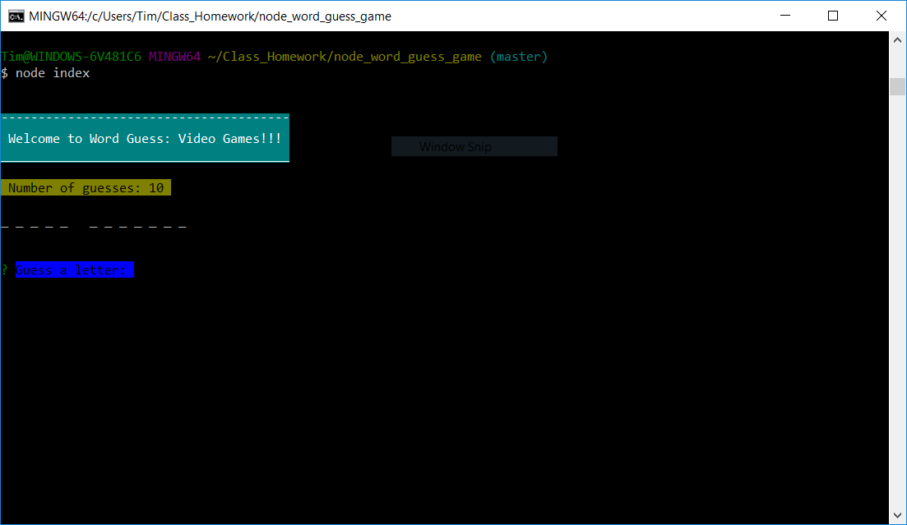
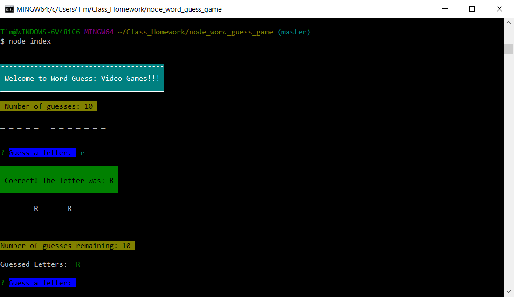
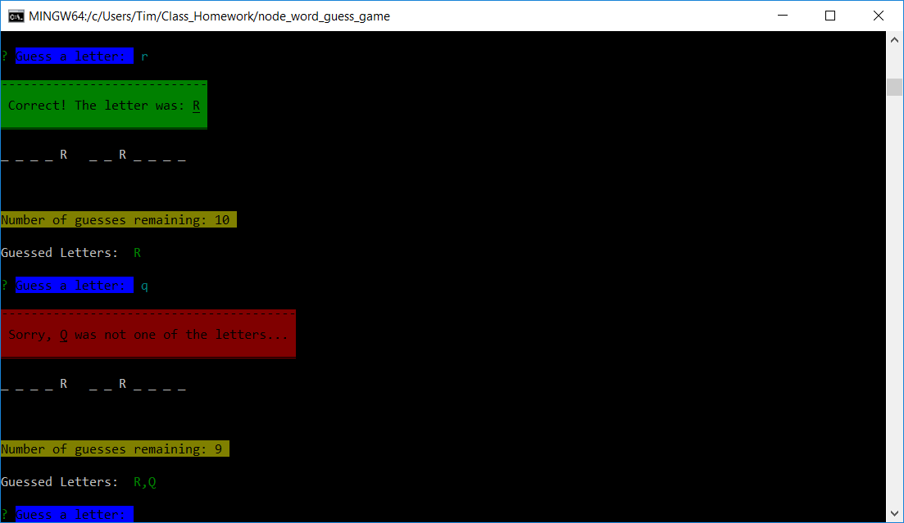
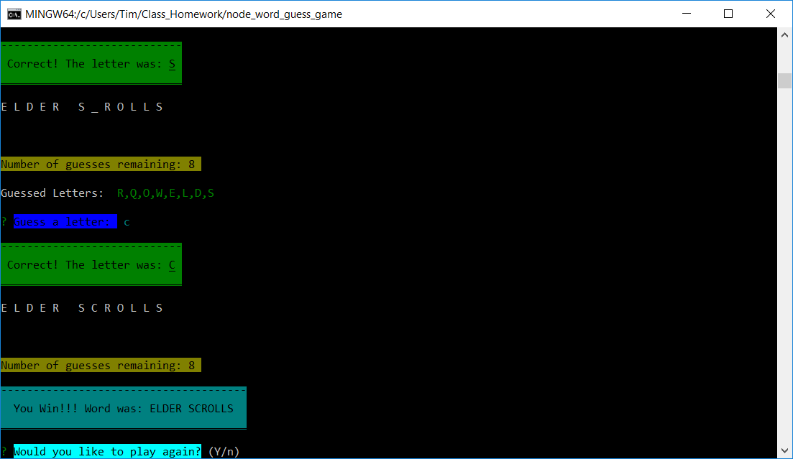
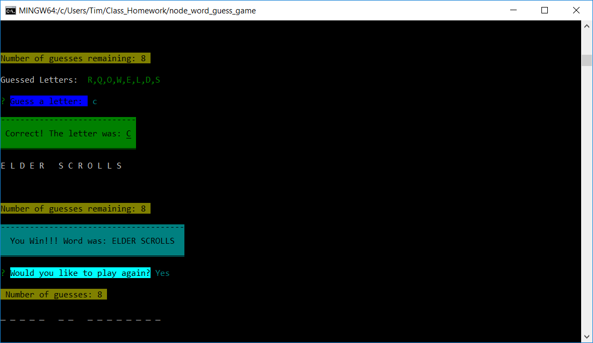
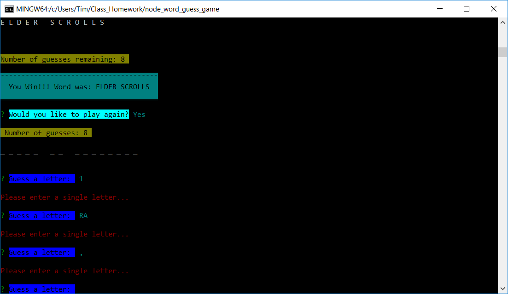

# node_word_guess_game

# https://timlukens.com -- Portfolio

##### This node word guess game uses the following node packages: 

* Inquirer
* Is-Letter
* Chalk

##### If cloning the repo be sure to run npm install to get packages required for use...

___

## Hey there, this my simple, but neat node command line word guess game.

### Below I'll show some images of the game in use. Clone the repo and try it out for yourself!

___

### Starting out you run node index.js to start the program.
___

### This is displayed if you guess a correct letter...
___

### If you guess a wrong letter it tells you the letter you entered was not one of the letters in the word.
___

### When you finish completing the word it shows you that you have won and then asks you if you'd like to play again.

___

### If you choose to play again then a new word is generated and the game starts over.

### Otherwise the game ends.

___

#### This shows the functionality of the Is-Letter package. 

#### Here we see that if you do not guess a single letter or guess something other than a letter then it will prompt you for a new guess.

___ 

## Feel free to check out my site and give any feedback.